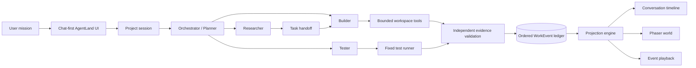
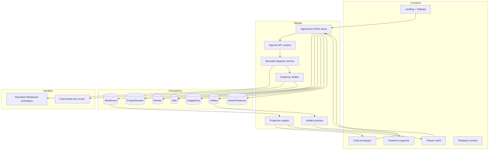

<div align="center">


<br />

# AGENTLAND

### Give AI agents a world to work in.

**Chat with a team of agents. Watch them plan, build, test, and deploy inside a living RPG world — then inspect the evidence behind every action.**

<br />

[](#)
[](#)
[](#)
[](#)
[](#)
[](#)

<br />

[**Quick Start**](#-quick-start) · [**How It Works**](#-how-agentland-works) · [**Architecture**](#-architecture) · [**Demo Flow**](#-the-90-second-demo) · [**Security**](#-security--trust-model)

</div>

---

<div align="center">

> ### Most AI tools show you the answer. AgentLand shows you the team that got there.

</div>

AgentLand is a **chat-first, evidence-driven visual workspace for AI agents**.

You submit a mission through an interface that feels familiar — like ChatGPT — and AgentLand brings a team of specialized workers to life inside an explorable game world.

The Planner breaks down the mission. The Researcher finds an approach. The Builder modifies the project. The Tester verifies the result. Buildings activate, workers move, failures become visible, and completed artifacts unlock — but **only when persisted evidence proves that the work happened**.

<br />


---

## ✦ Project Showcase & Demo

### 🎥 Demo Videos
<table>
  <tr>
    <td align="center" width="50%"><b>Cinematic Workflow Walkthrough</b></td>
    <td align="center" width="50%"><b>Demo Walkthrough Video</b></td>
  </tr>
  <tr>
    <td>
      <video src="agent%20playground/presentation_assets/Create_a_cinematic_second_p.mp4" controls width="100%"></video>
    </td>
    <td>
      <video src="agent%20playground/presentation_assets/make_a_demo_video_Create_a_cin.mp4" controls width="100%"></video>
    </td>
  </tr>
</table>

### 🖼️ Screenshots & Diagrams

<div align="center">
  
  <p><i>AgentLand system architecture and visualization flow</i></p>
</div>

<br />

<table>
  <tr>
    <td width="50%"></td>
    <td width="50%"></td>
  </tr>
  <tr>
    <td width="50%"></td>
    <td width="50%"></td>
  </tr>
  <tr>
    <td colspan="2" align="center"></td>
  </tr>
</table>

---

## ✦ The idea in one sentence

```text
Tell AgentLand what to build → watch the agent team execute → inspect the proof.
```

AgentLand is not a game pretending to perform work.

It is a real agent workflow represented as a world:

| Real execution | AgentLand world |
|---|---|
| Mission accepted | Town Hall activates |
| Task assigned | Worker receives a quest |
| Research begins | Research Desk lights up |
| File change verified | Code Factory progresses |
| Test starts | Tester enters the Testing Facility |
| Test fails | Facility turns red |
| Test passes | Facility turns green |
| Artifact verified | Deployment Tower unlocks |
| Provider is blocked | Worker and building stop honestly |

---

## ✦ Why AgentLand exists

Multi-agent systems are powerful, but they are difficult to understand.

When several agents work together, users usually see one of two things:

- a loading spinner;
- an unreadable wall of logs.

AgentLand turns that hidden execution into a spatial interface where anyone can answer:

- **Who is working?**
- **What are they doing?**
- **Which task are they blocked on?**
- **What files changed?**
- **Did the test actually run?**
- **Which model was used?**
- **What evidence supports the result?**
- **Can another person join and verify it?**

---

## ✦ How AgentLand works



### The heartbeat

```text
Agent action
    ↓
Independent file / test / artifact verification
    ↓
Ordered persisted event
    ↓
Reconstructable session state
    ↓
Chat update + world animation + evidence panel
```

The browser never decides that a task succeeded. The world is a **read-only projection** of confirmed backend state.

---

## ✦ Meet the agent team

<table>
<tr>
<td width="25%" align="center"><b>🧠 Planner</b></td>
<td width="25%" align="center"><b>🔬 Researcher</b></td>
<td width="25%" align="center"><b>🛠 Builder</b></td>
<td width="25%" align="center"><b>🧪 Tester</b></td>
</tr>
<tr>
<td>Understands the mission, creates a bounded plan, and assigns work.</td>
<td>Investigates project context and produces implementation guidance.</td>
<td>Performs approved project changes inside a contained workspace.</td>
<td>Runs fixed verification commands and records real pass/fail evidence.</td>
</tr>
<tr>
<td><b>World:</b> Town Hall</td>
<td><b>World:</b> Research Desk</td>
<td><b>World:</b> Code Factory</td>
<td><b>World:</b> Testing Facility</td>
</tr>
</table>

When an artifact passes verification, the **Deployment Tower** becomes available.

---

## ✦ What makes it different

### Evidence, not roleplay

AgentLand does not trust an agent saying:

> “I changed the file and the tests passed.”

Instead, AgentLand independently:

1. hashes the approved workspace before execution;
2. runs the bounded worker;
3. hashes the workspace again;
4. identifies created, modified, and deleted files;
5. runs a fixed test command;
6. stores the real exit code, duration, and bounded output;
7. validates the artifact path and SHA-256;
8. persists the complete ordered history.

Only then does the city progress.

### Replayable execution

Every city frame is reconstructed from confirmed events up to a selected sequence.

You can:

- play or pause the workflow;
- move backward and forward event by event;
- inspect intermediate worker and building states;
- refresh the page and recover the same session;
- compare a successful execution with a blocked one.

### Shared verification

A second browser can join the same session, see the same confirmed world state, and submit a bounded verification request.

That request becomes a real Tester task with an idempotent lifecycle:

```text
Task created
→ Task assigned
→ Test started
→ Test passed / failed
→ Task completed / failed
```

---

## ✦ Product experience

### 1. Start in chat

Enter a mission such as:

```text
Build a collaborative whiteboard with isolated rooms.
```

Choose a runtime:

- **OpenAI API** — uses the configured OpenAI model;
- **Evidence Demo** — deterministic, reliable proof of the complete evidence pipeline.

### 2. Enter the living world

The session opens with:

- recent missions and deterministic titles;
- an event-derived conversation timeline;
- the live Phaser world;
- clickable workers and buildings;
- execution mode, sequence, usage, and viewer count;
- bounded follow-up verification.

### 3. Inspect everything

Click the Builder to see:

- current task;
- runtime identity;
- files changed;
- before and after SHA-256 hashes;
- tool exit state;
- provider/model metadata;
- blockers.

Click the Testing Facility to see:

- fixed command identifier;
- exit code;
- duration;
- bounded stdout/stderr;
- pass/fail result.

Click the Deployment Tower to open a contained artifact preview.

---

## ✦ Current capabilities

- [x] Chat-first mission composer
- [x] Cinematic AgentLand world
- [x] OpenAI API runtime path
- [x] Volatile local API-key handling
- [x] Model selection
- [x] Evidence Demo fallback
- [x] Planner, Researcher, Builder, and Tester roles
- [x] Ordered immutable WorkEvent history
- [x] Idempotent dispatch
- [x] Independent SHA-256 workspace evidence
- [x] Fixed real test execution
- [x] Contained artifact preview
- [x] Truthful provider and runtime failures
- [x] Clickable workers and buildings
- [x] Event playback
- [x] Live polling
- [x] Shared viewers
- [x] Bounded contributor verification requests
- [x] Responsive Chat / World experience
- [x] 9/9 AgentLand tests passing

---

## ✦ Execution modes

| Mode | Meaning |
|---|---|
| **OPENAI API** | The selected OpenAI model is used to produce a safe public plan before the bounded evidence workflow. |
| **EVIDENCE DEMO** | A deterministic runner demonstrates the complete evidence and visualization pipeline. |
| **API BLOCKED** | The provider request could not complete. AgentLand records the failure and fabricates nothing. |
| **NOT STARTED** | The mission exists but no workflow has started. |

If the API is rate-limited, AgentLand records the provider failure truthfully and keeps **Evidence Demo** available for a reliable presentation flow.

---

## ✦ Architecture



---

## ✦ Repository structure

```text
agent-playground/
├── environment/
│   └── frontend_server/
│       ├── agentland/
│       │   ├── agent_runtime/
│       │   │   ├── credentials.py
│       │   │   └── service.py
│       │   ├── migrations/
│       │   ├── static/al/
│       │   ├── templates/agentland/
│       │   ├── city.py
│       │   ├── projection.py
│       │   ├── runners.py
│       │   ├── services.py
│       │   ├── shell.py
│       │   ├── views.py
│       │   └── tests.py
│       └── frontend_server/
│           └── settings/
├── townos_demo_workspace/
│   └── whiteboard/
│       ├── src/
│       ├── tests/
│       └── index.html
└── docs/
    └── agentland-attribution.md
```

> The internal `townos_demo_workspace` path is retained for compatibility. It is never exposed in user-facing API responses or artifact URLs.

---

## ✦ Quick start

### Prerequisites

- Python 3.9+
- Node.js 18+
- Git
- An OpenAI API key for API mode

### 1. Clone

```bash
git clone <YOUR_REPOSITORY_URL>
cd agent-playground/environment/frontend_server
```

### 2. Create an environment

```bash
python -m venv .venv
```

**Windows**

```powershell
.venv\Scripts\activate
```

**macOS / Linux**

```bash
source .venv/bin/activate
```

### 3. Install dependencies

```bash
pip install -r requirements.txt
```

### 4. Apply migrations

```bash
python manage.py migrate --noinput
```

### 5. Run AgentLand

```bash
python manage.py runserver 127.0.0.1:8002
```

Open:

```text
http://127.0.0.1:8002/agentland/
```

### 6. Configure OpenAI

Open **Settings** inside AgentLand:

1. enter your OpenAI API key;
2. choose a supported model;
3. save the runtime configuration;
4. start a mission.

The key is kept only in the running server process and is cleared when AgentLand restarts.

An optional ignored local bootstrap file may be used during development:

```text
.env.agentland.local
```

Never commit this file.

---

## ✦ Run the test suite

```bash
python manage.py check
python manage.py migrate --noinput
python manage.py test agentland
```

Expected:

```text
9/9 AgentLand tests passing
```

The bounded whiteboard verification uses:

```bash
node --test tests/room-isolation.test.js
```

---

## ✦ The 90-second demo

1. Open AgentLand.
2. Open Settings and confirm the model.
3. Enter:

   ```text
   Build a collaborative whiteboard with isolated rooms.
   ```

4. Submit the mission.
5. Watch Town Hall activate.
6. Follow the Builder into the Code Factory.
7. Inspect the independently detected file change and hashes.
8. Watch the Tester run the fixed isolation test.
9. Open the verified artifact from the Deployment Tower.
10. Join the same session from a second browser.
11. Submit an additional verification request.
12. Replay the full execution event by event.

### Closing line

> **AgentLand does not visualize what an AI claims it did. It visualizes what the system can prove happened.**

---

## ✦ Security & trust model

AgentLand is built around explicit evidence and constrained execution.

### API keys

- held only in server-process memory;
- scoped to the Django browser session;
- never stored in SQLite;
- never stored in WorkEvents;
- never returned through API responses;
- never exposed to Phaser;
- cleared on server restart.

### Workspace

- fixed resolved root;
- parent traversal rejected;
- external absolute paths rejected;
- symlink escapes rejected;
- before/after SHA-256 manifest generated independently.

### Tests

- fixed executable and arguments;
- `shell=False`;
- fixed working directory;
- scrubbed environment;
- hard timeout;
- bounded and redacted output;
- no user-supplied commands.

### Artifacts

- logical paths only;
- resolved containment check;
- SHA-256 verification;
- bounded same-origin preview.

### Reasoning

AgentLand never claims to display hidden chain-of-thought.

The UI shows only:

- objectives;
- public plans;
- actions;
- evidence;
- decisions;
- task handoffs;
- blockers;
- results.

---

## ✦ API routes

<details>
<summary><b>Core routes</b></summary>

```text
GET    /agentland/
GET    /agentland/sessions/<id>/
GET    /agentland/sessions/<id>/city/
POST   /agentland/sessions/
POST   /agentland/sessions/<id>/dispatch-builder/
GET    /agentland/sessions/<id>/snapshot/
GET    /agentland/sessions/<id>/events/
GET    /agentland/settings/openai/
POST   /agentland/settings/openai/
DELETE /agentland/settings/openai/
```

Additional internal routes support:

- live city state;
- viewer heartbeats;
- verification requests;
- baseline reset;
- contained artifact preview.

</details>

---

## ✦ Roadmap

- [ ] Native MCP headquarters that unlock new map regions
- [ ] More project templates beyond the whiteboard vertical
- [ ] Richer real-time agent-to-agent handoff visualization
- [ ] Multiplayer roles and approvals
- [ ] Provider-agnostic runtime adapters
- [ ] Project-generated city layouts
- [ ] GitHub pull-request and deployment workflows
- [ ] Public session sharing and team workspaces

The current hackathon build intentionally prioritizes one reliable, inspectable vertical slice over broad platform scope.

---

## ✦ Foundation & attribution

AgentLand builds on the open-source **Generative Agents: Interactive Simulacra of Human Behavior** research environment by Joon Sung Park, Joseph C. O’Brien, Carrie J. Cai, Meredith Ringel Morris, Percy Liang, and Michael S. Bernstein.

AgentLand transforms that foundation from a fictional social simulation into an evidence-driven workspace for productive AI-agent teams.

Major AgentLand contributions include:

- API-first mission orchestration;
- bounded worker execution;
- independent file and test evidence;
- immutable ordered work history;
- event-derived chat and world projection;
- shared verification;
- replayable execution;
- safe artifact preview;
- model, usage, and runtime observability.

The upstream repository separately credits its visual artists:

- Background art: **PixyMoon** (`@_PixyMoon_`)
- Furniture/interiors: **LimeZu** (`@lime_px`)
- Character design: **ぴぽ** (`@pipohi`)

Review the applicable licenses and attribution requirements for any inherited visual assets before production distribution.

See [`docs/agentland-attribution.md`](docs/agentland-attribution.md) for the project’s attribution boundary.

---

## ✦ Built by

<div align="center">

### Built for people who want to understand what their agents are actually doing.

<br />

**AgentLand**

*Where AI agents build together.*

<br />

⭐ Star the repository if you want agent workflows to feel less like logs — and more like worlds.

</div>
